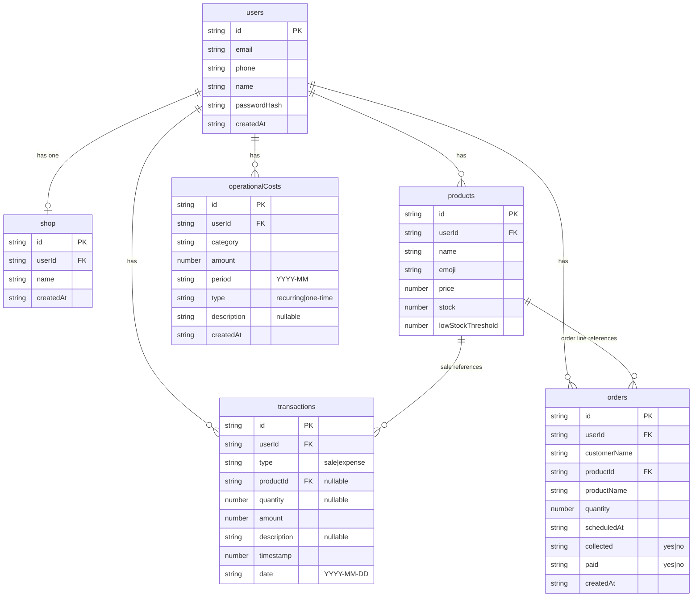

# ERD and Google Sheets Layout — Catat Jualan

## ERD (normalized)

Users, Shop, Products, Transactions, and OperationalCosts are stored in one Google Spreadsheet; each row is scoped by `userId` where applicable. Auth uses the **Users** sheet (includes passwordHash).

- **users:** Stored in **Users** sheet (id, email, phone, name, passwordHash, createdAt). Auth (login/register) reads/writes this sheet. **Security:** Restrict the spreadsheet to the service account only; do not share with other users, as the sheet contains password hashes.
- **shop:** One row per user in **Shop** sheet (id, userId, name, createdAt). Name = toko name.
- **products:** One row per product; `userId` scopes to owner.
- **transactions:** One row per transaction; `userId` scopes to owner; `productId` references Products (nullable for expenses). No `productName` in storage — resolve from products when needed.
- **operationalCosts:** Recurring or one-time operational costs (rent, electricity, etc.); `period` e.g. `2025-01`; `type` = `recurring` or `one-time`.
- **orders:** Customer orders (pesanan): one row per order line; `customerName`, `productId`, `productName`, `quantity`, `scheduledAt` (when to send/collect), `collected` (yes/no), `paid` (yes/no).

## Google Spreadsheet layout

**One spreadsheet** (e.g. "Catat Jualan DB") with six sheets. Row 1 = header; data from row 2 onward.

| Sheet name          | Columns (row 1 = header) |
|---------------------|---------------------------|
| **Users**           | id, email, phone, name, passwordHash, createdAt |
| **Shop**            | id, userId, name, createdAt |
| **Products**        | id, userId, name, emoji, price, stock, lowStockThreshold |
| **Transactions**    | id, userId, type, productId, quantity, amount, description, timestamp, date |
| **OperationalCosts**| id, userId, category, amount, period, type, description, createdAt |
| **Orders**          | id, userId, customerName, productId, productName, quantity, scheduledAt, collected, paid, createdAt |

- All values as strings or numbers; `timestamp` as number (Unix ms). Empty cells for optional fields.
- Share the spreadsheet with the **Google Service Account** email (Editor) only; do not share with other people, as **Users** contains password hashes.

## Creating the spreadsheet (manual)

1. Create a new Google Spreadsheet and name it (e.g. "Catat Jualan DB").
2. Add sheets **Users**, **Shop**, **Products**, **Transactions**, **OperationalCosts**, **Orders** with the header row from the table above.
3. Copy the spreadsheet ID from the URL and set `GOOGLE_SHEETS_SPREADSHEET_ID` in `server/.env`.
4. Share the spreadsheet with the service account email (from the JSON key) as Editor only.

**Option B (script):** From the `server` folder run `node scripts/ensure-sheets-tables.js`. This adds all six sheets if missing and writes the header rows. Idempotent.
